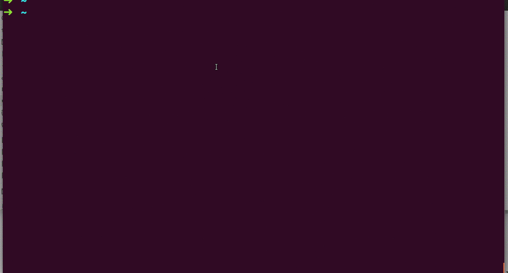

WikiCUI
====

You can wiki articles on your shell.

## Description

WikiCUI fetches the article you designated from wikipedia and prints the abstract part of the article.
You can designate multiple languages.
Articles are fetched from wikipedia of the languages you designated.
WikiCUI wikies repeatedly for each wikipedia of your designated languages, and show you the first hit article. Without any language options, WikiCUI uses en (English) and ja (Japanese, my mother tongue). This setting can be easily changed by editing wikiCUI/defualt_languages.txt.

## Demo



## Usage
```wikicui name of article -llanguages -lyou -llike```

## Install

```alias wikicui="ruby path/to/dir/wikiCUI/wikiCUI.rb"```

## Author

[Yuchiki](https://github.com/yuchiki1000yen)
